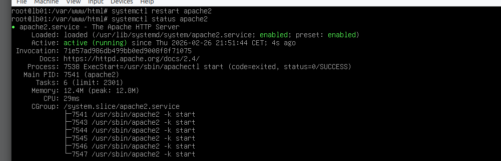
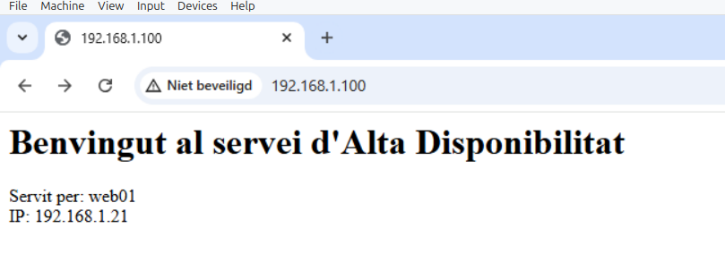
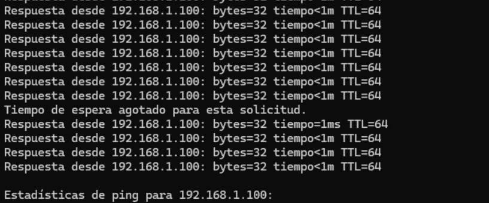
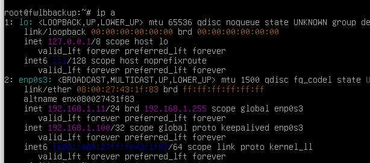
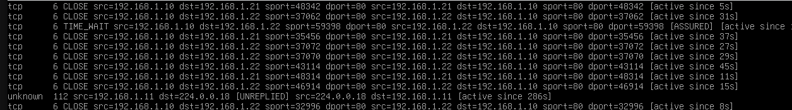

````markdown
# Prova de Concepte: Servei Web d'Alta Disponibilitat -- per v0id0100


## Índex:
- [1. Què és l'Alta Disponibilitat?](#1-que-es-lalta-disponibilitat)
- [2. Arquitectura del Projecte](#2-arquitectura-del-projecte)
- [3. Eines que farem servir](#3-eines-que-farem-servir)
- [4. Exemple de Desenvolupament Web](#4-exemple-de-desenvolupament-web)
- [5. Sincronització de Dades entre nodes](#5-sincronitzacio-de-dades-entre-nodes)
- [6. Implementació del Balancejador de Càrrega](#6-implementacio-del-balancejador-de-carga)
- [7. Sincronització / Comprovació d'estat entre nodes](#7-sincronitzacio--comprovacio-destat-entre-nodes)
- [8. Seguretat i Tallafocs](#8-seguretat-i-tallafocs)
- [9. Prova de Concepte](#9-prova-de-concepte)
- [10. Anàlisi de Millores i Punts de Fallada](#10-analisi-de-millores-i-punts-de-fallada)
- [11. Qui sóc?](#11-qui-soc)
- [12. Agraïments a](#12-agraiments-a)

---

## 1. Què és l'Alta Disponibilitat?
L'Alta Disponibilitat és la definició que un **servidor o servei sigui accessible i operatiu el 100% del temps**, o almenys minimitzant els períodes d'inactivitat.

S'utilitza molt actualment en xarxes socials, bancs i altres tipus d'aplicacions.

### Per què aquesta PoC és Alta Disponibilitat?
En aquest projecte implementaré un clúster web, un conjunt de nodes que treballen junts; el client només veu un portal web, però darrere hi ha 2 nodes (només per provar el concepte) treballant i servint el portal al mateix temps.

- Intentant eliminar els **Punts Únics de Fallada (Single Points of Failure)**, que són els punts que si un falla, causaria la caiguda de tot el sistema.

- Implementant **failover**: si un dels nodes falla, l'altre s'activarà immediatament sense que el client ho percebi perquè el DNS (o la IP en aquest cas) no canvia.

- Per això faré servir una eina anomenada ***conntrackd*** que el que fa és comprovar contínuament si la seva *parella* segueix viva.

---

## 2. Arquitectura del Projecte:
| ROL | NOM HOST | IP | Funció|
|-----|----------|----|------|
| FW/LB Master | Lb01 | 192.168.1.10 | Node Actiu, gestiona la VIP |
| FW/LB Backup | Lb02 | 192.168.1.11 | Node Passiu, sincronitza la funcionalitat |
| Servidor Web | Web01 | 192.168.1.21 | Servei Web Apache |
| IP Virtual (VIP) | - - - - - - - - - - - - | 192.168.1.100 | IP flexible, punt d'entrada |

---

## 3. Eines que farem servir:
En aquesta PoC necessitem alguns requisits abans de procedir:
- Per al servei web en els nodes **Web01, Web02**:
    ```bash
    sudo apt install apache2 php -y
    ```
- Per sincronitzar dades entre nodes en **Lb01, Lb02**:
    ```bash
    # En lb02 (Backup)
    sudo apt install openssh-server
    # En lb01 (Master)
    sudo apt install openssh-client
    # En ambdós: Lb01, Lb02
    sudo apt install rsync
    ```
- Per balancejar la càrrega entre nodes:
    ```bash
    # En lb01 (Master)
    sudo apt install haproxy
    ```
- Per controlar l'adreça VIP:
    ```bash
    # En ambdós: Lb01, Lb02
    sudo apt install keepalived -y
    ```
- Per comprovar l'estat entre nodes:
    ```bash
    # En ambdós: Lb01, Lb02
    sudo apt install conntrackd -y
    ```
- Per programar tasques:
    - `crontab`
- Com en tot desenvolupament web necessites un tallafocs, **EN TOTS ELS NODES**:
    ```bash
    sudo apt install ufw -y
    ```

---

## 4. Exemple de Desenvolupament Web:
Posaré un codi HTML i PHP senzill per veure la web en producció, **AQUÍ POTS POSAR EL TEU CÓDIGO**:
**En Lb01 i Lb02**:
```html
<h1>Benvingut al meu servei web d'alta disponibilitat</h1>
<footer>
    Servit per: <?php echo gethostname(); ?> <br>
    IP: <?php echo $_SERVER['SERVER_ADDR']; ?>
</footer>
```

Ara has de reiniciar el servidor per aplicar l'HTML a la web de producció:
```bash
sudo sytemctl restart apache2
# Sempre es recomana comprovar si tot està OK:
sudo systemctl status apache
```
Ha d'aparèixer:


---

## 5. Sincronització de Dades entre nodes:
Primer hem de tenir un **parell de claus (Key Pair)** per iniciar sessió del Master al Backup i així sincronitzar dades:
Així, a **Web01** generarem les claus:
```bash
ssh-keygen -t ed25519
# Les opcions següents no importen, pots prémer enter
```

Ara les hem d'enviar al servidor:
```bash
ssh-copy-id Web02@192.168.1.22
# Introdueix la contrasenya de Lb02 i tindràs la clau a /home/username/.ssh/authorizedkeys
```

Ara a **Web01** crearem un script per sincronitzar automàticament dues vegades al dia.
```bash
#!/bin/bash

SOURCE=/var/www/html/documentname.php
DESTINATION="Web02@192.168.1.22:/var/www/html/documentname.php"
LOGFILE="/var/log/rsync_sync.log"

echo "--- Sync started at $(date) ---" >> $LOGFILE
rsync -avz $SOURCE $DESTINATION >> $LOGFILE 2>&1

if [ $? -eq 0 ]; then
    echo "Sync successful." >> $LOGFILE
else
    echo "Sync FAILED. Check network or SSH-keys." >> $LOGFILE
fi
```

Després cal donar permisos d'execució:
```bash
chmod +x script.sh
```

Ara ho programarem per executar-se 2 vegades al dia:

Prem `crontab -e` i afegeix al final del fitxer:
```text
0 */12 * * * /bin/bash /home/username/script.sh
```

---

## 6. Implementació del Balancejador de Càrrega:
Faré servir HAProxy en **Lb01 (Master)** per balancejar entre nodes.

- Fitxer de configuració (`/etc/haproxy/haproxy.cfg`), (**posa això al final del fitxer**):
    ```text
    frontend http_front
    bind *:80
    default_backend web_backend
    backend web_backend
    balance roundrobin
    server web01 192.168.1.21:80 check
    server web02 192.168.1.22:80 check
    ```
- Per veure la teva interfície usa:
    ```bash
    ip a
    ```
- Un cop fet això, has de configurar l'adreça **VIP** (`/etc/keepalived/keepalived.conf`):
    ```text
    vrrp_instance VI_1 {
        state MASTER
        interface YOURINTERFACE
        virtual_router_id 51
        priority 100
        advert_int 1
        authentication {
            auth_type PASS
            auth_pass 1111
        }
        virtual_ipaddress {
            192.168.1.100
        }
    }
    ```
- Recàrrega i comprova l'estat:
    ```bash
    sudo systemctl restart keepalived && sudo systemctl status keepalived
    ```

- Quan acabem el **Master**, configura ara el **Slave** o **Backup**:
    ```text
    vrrp_instance VI_1 {
        state SLAVE
        interface YOURINTERFACE
        virtual_router_id 51
        priority 90
        advert_int 1
        authentication {
            auth_type PASS
            auth_pass 1111
        }
        virtual_ipaddress {
            192.168.1.100
        }
    }
    ```
- Reinicia i comprova l'estat.

---

## 7. Sincronització / Comprovació d'estat entre nodes:
- **conntrackd** s'utilitza per comprovar cada pocs segons l'estat entre nodes i si un falla enviar l'estat a l'altre.

- Un cop instal·lat (vegeu el [pas 3](#3-eines-que-farem-servir)) has d'afegir al final del fitxer (`/etc/conntrackd/conntrackd.conf`):

    ```text
    Sync {
        Mode FTFW {
            ResendQueueSize 1024
            ACKWindowSize 300
        }
        Multicast {
            IPv4_address 225.0.0.50
            Group 3780
            Interface YOURINTERFACE
        }
    }
    ```

- Com sempre recarrega i comprova l'estat correcte.

---

## 8. Seguretat i Tallafocs:
És important obrir els ports correctes a cada servidor:

- Al clúster web (Web01, Web02):
    ```bash
    sudo ufw allow 80/tcp
    # Permetrem ssh NOMÉS des de la nostra xarxa
    sudo ufw allow from 192.168.1.0/24 to any port 22 proto tcp

    # Activar el tallafocs
    sudo ufw enable
    ```

- Als Load Balancers / Firewalls (Lb01, Lb02):
    ```bash
    sudo ufw allow 80/tcp
    # Permetrem ssh NOMÉS des de la nostra xarxa
    sudo ufw allow from 192.168.1.0/24 to any port 22 proto tcp

    # Activar el tallafocs
    sudo ufw enable
    ```

- Hem de permetre les connexions de **VRRP** (VIP) i **conntrackd**:
    ```bash
    # A Lb01:
    sudo ufw allow from 192.168.1.11 to any port 3780 proto udp
    ```

    ```bash
    # A Lb02:
    sudo ufw allow from 192.168.1.10 to any port 3780 proto udp
    ```

- Finalment recarrega el tallafocs:
    ```bash
    sudo ufw reload
    ```

---

## 9. Prova de Concepte:
Primer accedim al portal d'entrada a **192.168.1.100**:


Proves d'Alta Disponibilitat:
- Ara farem un *ping* infinit per provar la disponibilitat i apaguem el ***Master***; hauria de fallar un ping però la VIP hauria de moure's al ***Slave***:


- Comprovant que el slave té la IP .100:


- Verifica els logs a */var/log/conntrackd.log*:


- Provant *failover* entre nodes web:
    - Aquí apagaré Web01 i comprovaré si Web02 respon:
    

    Respon a través de la mateixa IP i si comprovem el text sabrem que respon el Servidor 2 (*192.168.1.22*)

---

## 10. Anàlisi de Millores i Punts de Fallada:
- Si Web01 falla abans de sincronitzar les dades a Web02, tots els canvis realitzats en aquell període es perdran. **Hauria de sincronitzar-se cada vegada que s'actualitzi codi.**
- La configuració d'HAProxy només està a Lb01; si aquest Balancejador falla, tot fallarà perquè és un *punt únic de fallada*.
- UFW està configurat només en una direcció; si hi ha un failover causat per Lb01, les regles no s'actualitzaran automàticament, això hauria de ser bidireccional.

---

## 11. Qui sóc?
- Actualment estic estudiant ciberseguretat i fent pràctiques en una empresa treballant amb Amazon Web Services.
- Al meu temps lliure m'agrada millorar els meus coneixements d'hacking ètic, programar eines open-source; les pots veure al meu perfil. És un món increïble: com més saps, més te n'adones del que et queda per aprendre.
- És la meva segona Prova de Concepte però no serà l'última, n'estic força segur.

---

## 12. Agraïments a:
- Als meus professors, que m'han ensenyat com funciona IT i a investigar sempre per nova informació i actualitzar-me.
- A la meva nòvia per donar-me suport en tot i intentar entendre coses que per a gent normal són molt enrevessades.
- I, òbviament, als meus pares per donar-me suport amb els estudis.
- Gràcies per llegir aquesta PoC fins aquí, ¡ahaha!

---

<h1 style="text-align: center;">Per v0id0100</h1>
````
